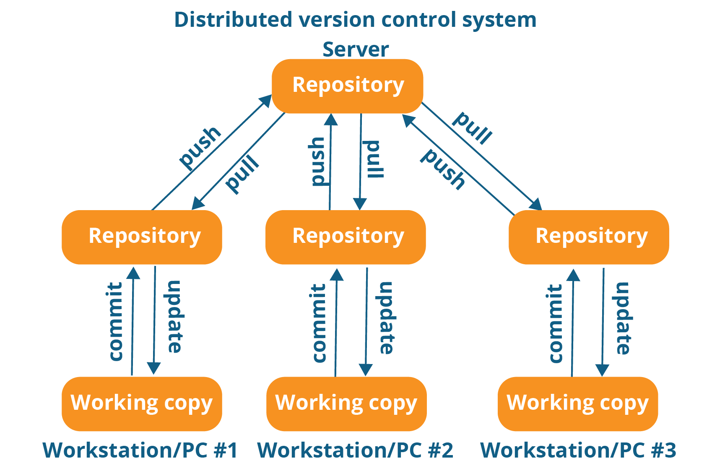

# `GIT`

> PDF File available in the repo but best view available in README.md file.

## `Introduction`
Git is an Open Source ***Distributed Version Control System*** designed to manage the teamwork done on a project. Git helps the contributors to track the changes in files or projects and speed up the overall process.
- **It is designed for :**
    - Speed
    - Simplicity
    - Fully Distributed
    - Excellent support for parallel development
    - Integrity
     
## `Version Control System ` 
  Version Control System (VCS) is a software that helps software developers to work together and maintain a complete history of their work.

- **Functions of a VCS :**
    - Allows developers to work simultaneously.
    - Does not allow overwriting each other’s changes.
    - Maintains a history of every version.
     
- **Types of VCS :** 

    - **`Centralizted version conrol system (CVCS) :`**
    Centralized version control system (CVCS) uses a central server to store all files and enables team collaboration. But the major drawback of CVCS is its single point of failure, i.e., failure of the central server.
    
        
    - **`Distributed version control system (DVCS) :`**
    Distributed VCS introduced significant improvement over the risks posed by Central VCS.These systems do not necessarily rely on a central server to store all the versions of a project’s files. Instead, every developer "clones" a copy of a repository and has the full history of the project on their own hard drive. This copy (or "clone") has all of the metadata of the original.
    

## `Github Vs Git`

    
  - **Github :** It is  web portal and cloud hosting service for your Git repositories.
  - **Git :** It is a Distributed Version Control System client for tracking versions of files.

 
## `Install`
  - GitHub for Windows
  https://windows.github.com
  - GitHub for Mac
  https://mac.github.com
  - Git for All Platforms
  http://git-scm.com
  - Git distributions for Linux and POSIX systems are available on
  the official Git SCM web site.

## `Git States`

  

  - **`Working area :`** 
Consider a project residing in your local system. This project may or may not be tracked by Git. In either case, this project directory is called your Working directory. Working directory is the directory containing .git folder.
In this state, Git is just aware of the files in the project. It doesn’t track the files yet. To track the files, we've to commit these files by first adding the files to the staging area.
    > **`Note :`** **git init** – Command to initialize a Git repository
  - **`Staging area :`** 
Staging area is the playground where you group, add and organize the files to be committed to Git for tracking their versions. Committing process is done in the staging area on the files which are added to the Index after git add command is executed. This committing process is done by the use of git commit command. This command commits the staged changes to the local repository
    > **`Note :`** **git add** – Command to add files to staging area.
  - **`Git repository :`**
Git repository is the database where metadata about project file's history will be tracked.Now that the files to be committed are grouped and ready in the staging area, we can commit these files. So, we commit this group of files along with a commit message explaining what is the commit about. Apart from commit message, this step also records the author and time of the commit. Now, a snapshot of the files in the commit is recorded by Git. The information related to this commit (names of files committed, date and time of commit, author of commit, commit message) is stored in the Git directory.
    > **`Note :`** **git commit -m "your message"** – Command to commit files to Git repository with message 
  - **`Remote repository :`**    
  It means mirror or clone of the local Git repository in Github. This will allow other collaborators to view the code. Thus, whatever changes you make in the local Git repository will be visible to other collaborators when you push your code to the remote repository. Command to push the code to remote repository in Github is git push.

    
    > **`Note :`** 
    > - **git push** - Command to push commits from local Git repository to remote Git repository hosted in Github.
    > - **git pull** - Pull command is used to fetch the commits from a remote repository and stores them in the remote branches.


## `Git Commands`

- **`Configuring git`** :
*Configure user information for system level, user level and local repositories level*
  - **git config :** This command sets the author name and email address respectively to be used with your commits.
    ```
    : git config –-global user.name "FIRSTNAME LASTNAME"
    : git config –-global user.email "abc@example.com"
    : git config --global --list
    ```
  - **color highlighting :**
  The following commands enables color highlighting for Git in the console.
    ```
    git config --global color.ui auto
    ```
  - **Setting default editor :**
  By default, Git uses the system default editor, which is taken from the VISUAL or
  EDITOR environment variable. We can configure a different one by using git
  config.
    ```
    git config --global core.editor <editor>
    # for example:
    git config --global core.editor vim
    git config --global core.editor emacs
    ```
  > **`Note:`** 
  > - One can use --global to set configs for global level 
  > - --user for user level
  > - without any option (git config core.editor vim) for project level.
- **`Create repositories`** :
*When starting out with a new repository, you only need to do it
once either locally and adding remote url, then push to GitHub, or by cloning an
existing repository.*
  - **git init :** This command is used to start a new repository.
    ```
    git init [repository name]
    git remote add origin https://github.com/example/project.git
    ```
   
  - **git clone :** This command is used to obtain a repository from an existing URL.
    ```
    git clone [url]
    ```

- **`Make changes`** :
*Browse and inspect the evolution of project files*
  - **git add :** This command adds a file to the staging area.
    ```
    git add [file]  
    ```
  - This command adds one or more to the staging area.
    ```
    git add *  
    ```
  - **git commit :** This command records or snapshots the file permanently in the version history.
    ```
    git commit -m "[Type the commit message]"
    ```
  - This command commits any files you've added with the git add command and also commits any files you've changed since then.
    ```
    git commit -a  
    ```
  - **git tag :** This command is used to give tags to the specified commit.
    ```
    git tag [commitID]
    ```  
  - **git log :** This command is used to list the version history for the current branch.
    ```
    git log  
    ```
  - **decorated log** [add alias: `git config --global alias.lga "log --graph --oneline --all --decorate"`]
    ```
    git log --graph --oneline --all --decorate
    git lga (if alias added)
    ```
  - **git show :** This command shows the metadata and content changes of the specified commit.
    ```
    git show [commit]  
    ```
  - **git diff :** This command shows the file differences which are not yet staged.
    ```
    git diff  
    ```
  - This command shows the differences between the files in the staging area and the latest version present.
    ```
    git diff --staged 
    ```
  - This command shows the differences between the two branches mentioned.
    ```
    git diff [first branch] [second branch]  
    ```
- **`Redo commits`** :
*Erase mistakes and craft replacement history*
  - **git reset :** This command unstages the file, but it preserves the file contents.
    ```
    git reset [file]  
    ```
  - This command undoes all the commits after the specified commit and preserves the changes locally.
    ```
    git reset [commit]  
    ```
  - This command discards all history and goes back to the specified commit.
    ```
    git reset --hard [commit] 
    ```
- **`Check status`** :
  - **git status :** This command lists all the files that have to be committed.
    ```
    git status  
    ```
  - **git rm :** This command deletes the file from your working directory and stages the deletion.
    ```
    git rm [file]  
    ```

- **`Git Branches`** : *Branching means diverging from the mainline and continue to work separately without messing with the mainline.* 
 

  - **git branch :** 
      - This command lists all the local branches in the current repository.
        ```
        git branch  
        ```
    - This command creates a new branch
      ```
      git branch [branch name]  
      ```
    - This command deletes the feature branch.
      ```
      git branch -d [branch name]  
      ```
    - **git checkout :**
    This command is used to switch from one branch to another.
      ```
      git checkout [branch name]  
      ```
    - This command creates a new branch and also switches to it.
      ```
      git checkout -b [branch name]  
      ```
  - **`Add Remote :`**
  *A common repository on GitHub that all team member use to exchange their changes*
    - **git remote :** This command is used to connect your local repository to the remote server.
      ```
      git remote add [variable name] [Remote Server URL]  
      ```
- **`Synchronise changes :`**
*Synchronize your local repository with the remote repository on GitHub.com*
  - **git push :**
    - This command sends the committed changes of master branch to your remote repository.
      ```
      git push [variable name] master  
      ```
    - This command sends the branch commits to your remote repository.
      ``` 
      git push [variable name] [branch]  
      ```
    - This command pushes all branches to your remote repository.
      ```
      git push --all [variable name]  
      ```
    - This command deletes a branch on your remote repository.
      ```
      git push [variable name] :[branch name]  
      ```   
  - **git pull :** 
    - This command fetches and merges changes on the remote server to your working directory.
      ```
      git pull [Repository Link]  
      ``` 
    
  - **git fetch :** The git fetch command downloads commits, files, and refs from a remote repository into your local repo. Fetching is what you do when you want to see what everybody else has been working on.
    - Fetch all of the branches from the repository. This also downloads all of the required commits and files from the other repository.
      ``` 
      git fetch <remote>
      ```
    - Same as the above command, but only fetch the specified branch.
      ```
      git fetch <remote> <branch>
      ``` 
    - A power move which fetches all registered remotes and their branches:
      ```
      git fetch --all
      ```
    - The --dry-run option will perform a demo run of the command. 
      ```
      git fetch --dry-run
      ```
  - **git merge :** 
    - This command merges the specified branch’s history into the current branch.
      ```
      git merge [branch name]  
      ```
  - **git rebase :**
  *Rebase is another way to integrate changes from one branch to another. Rebase compresses all the changes into a single "patch." Then it integrates the patch onto the target branch.Unlike merging, rebasing flattens the history because it transfers the completed work from one branch to another. In the process, unwanted history is eliminated.*
    - **Create a feature branch based of master**
      ```
      git checkout -b feature_branch master
      ```
    - **Make changes whatever you want**
    - **commit your changes :**
      ```
      git commit -a -m "Adds new feature"
      ```
    - **git rebase :** This automatically rebases the current branch onto base.
      ```
      git rebase <base>
      ```
    - **Git Rebase Interactive :** *Running git rebase with the -i flag begins an interactive rebasing session. Instead of blindly moving all of the commits to the new base, interactive rebasing gives you the opportunity to alter individual commits in the process.*
      ```
      git rebase --interactive <base>
      ```
      - **Some git rebase interactive options :**
        ```
          pick 2231360 some old commit
          pick ee2adc2 Adds new feature
          # Rebase 2cf755d..ee2adc2 onto 2cf755d (9 commands)
          #
          # Commands:
          # p, pick = use commit
          # r, reword = use commit, but edit the commit message
          # e, edit = use commit, but stop for amending
          # s, squash = use commit, but meld into previous commit
          # f, fixup = like "squash", but discard this commit's log message
          # x, exec = run command (the rest of the line) using shell
          # d, drop = remove commit
        ```

- **`Git stash :`**
*Use git stash when you want to record the current state of the working directory and the index, but want to go back to a clean working directory. The command saves your local modifications away and reverts the working directory to match the HEAD commit.*
  - **git stash :** This command temporarily stores all the modified tracked files.
    ```
    git stash save  
    ```
  - This command restores the most recently stashed files.
    ```
    git stash pop  
    ```
  - This command lists all stashed changesets. 
    ```
    git stash list  
    ```   
  - This command discards the most recently stashed changeset.
    ```
    git stash drop  
    ```

- **`Git ignore :`**
*The .gitignore file is a text file that tells Git which files or folders to ignore in a project.
To create a local .gitignore file, create a text file and name it .gitignore (remember to include the DOT "." at the beginning).* 
  - **Steps to create a .gitignore file :**
    - Open Git Bash.
    - Navigate to the location of your Git repository.
  - **Create a .gitignore file for your repository.**
    ``` 
    $ touch .gitignore
    ```

## `Git Fork `
*When you fork a repository, you create a copy of the original repository (upstream repository) but the repository remains on your GitHub account.* A fork is a copy of a repository. Forking a repository allows to freely experiment with changes without affecting the original project.
  - **Steps in git fork :**
    - **`Fork a Repository:`** User creates a copy of the repository to their own GitHub account.
    - **`Code changes:`** This involves git cloning. Here the user makes the changes and push back to their own forked repository.
    - **`Send changes to Original Repository:`** This process is called as Pull Request in Git. At this step, the user sends the changes to the owner of the repository as a request. Now it is up to the owner to accept the changes or reject. Pull request is a request to the owner of the upstream repository to accept the user changes.
## `Git Alias`
*Aliases are used to create shorter commands that map to longer commands. Aliases enable more efficient workflows by requiring fewer keystrokes to execute a command.* 
- There is no direct git alias command. Aliases are created through the use of the git config command and the Git configuration files. As with other configuration values, aliases can be created in a local or global scope.
- These aliases were created with the --global flag which means they will be stored in Git's global operating system level configuration file. On linux systems, the global config file is located in the User home directory at ~/.gitconfig.
- **`Methods to create Git Alias :`** Aliases can be created through two primary methods.
  - **Directly editing Git config files :** The global or local config files can be manually edited and saved to create aliases.
    - **Examples :**
  ```
  [alias]
  co = checkout
  cm = commit -m
  po = push origin
  ci = commit --interactive
  cam = commit --amend --message
  lga = log --graph --all  --decorate --oneline
  ```
  - **Using the git config to create aliases :** git config command is a convenient utility to quickly create aliases. 
    - **Examples :**
  ```
  git config --global alias.co checkout
  git config --global alias.cm commit -m
  git config --global alias.po push origin
  git config --global alias.ci commit --interactive
  git config --global alias.cam commit --amend --message
  git config --global alias.lga log --graph --all  --decorate --oneline
  ```
 
## `Git Hooks`
*Git hooks are scripts that Git executes before or after events such as: commit, push, and receive. Git hooks are a built-in feature - no need to download anything. Git hooks are run locally.*
  - **Some example hook scripts include :**
    - **`pre-commit :`** Check the commit message for spelling errors.
    - **`pre-receive :`** Enforce project coding standards.
    - **`post-commit :`** Email/SMS team members of a new commit.
    - **`post-receive :`** Push the code to production.  
  
  - *Every Git repository has a .git/hooks folder with a script for each hook you can bind to. You're free to change or update these scripts as necessary, and Git will execute them when those events occur.*
# **`Frequently Asked Questions`**
### `Q1. What is a repository in Git?`
  - Repository in Git is a place where Git stores all the files. Git can store the files either on the local repository or on the remote repository.
   
### `Q2. Difference between clone and fork`
  - Forking is a concept while cloning is a process. Forking is just containing a separate copy of the repository and there is no command involved. Cloning is done through the command 'git clone' and it is a process of receiving all the code files to the local machine.

      
  
### `Q3. Difference between rebase and merge`
  - Rebasing and merging are both designed to integrate changes from one branch into another branch but in different ways.The **merge** will result as a combination of commits, whereas **rebase** will add all the changes in feature branch starting from the last commit of the master branch:
  
     

### `Q4. Difference between pull and fetch`
  - In the simplest terms, git pull does a git fetch followed by a git merge. 
    > `Note :` Git pull = git fetch + git merge 

     

### `Q5. What is a 'conflict' in git?`
  - Git can handle on its own most merges by using its automatic merging features. There arises a conflict when two separate branches have made edits to the same line in a file, or when a file has been deleted in one branch but edited in the other. Conflicts are most likely to happen when working in a team environment.
   
### `Q6. How to resolve a conflict in Git?`s
  - **The following steps will resolve conflict in Git-**
    - Identify the files that have caused the conflict.
    - Make the necessary changes in the files so that conflict does not arise again.
    - Add these files by the command git add.
    - Finally to commit the changed file using the command git commit.
     
### `Q7. What is the difference between the 'git diff' and 'git status'?`
  - **'git diff'** depicts the changes between commits, commit and working tree, etc. whereas **'git status'** shows you the difference between the working directory and the index, it is helpful in understanding a git more comprehensively. 'git diff' is similar to 'git status', the only difference is that it shows the differences between various commits and also between the working directory and index.
   
### `Q8. How will you know in Git if a branch has already been merged into master?`
  - To know if a branch has been merged into master or not you can use the below commands:
    - **`git branch --merged`** : It lists the branches that have been merged into the current branch.
    - **`git branch --no-merged`** : It lists the branches that have not been merged.
      
### `Q9. Explain the difference between reverting and resetting.`
  - Git reset is a powerful command that is used to undo local changes to the state of a Git repository. Git reset operates on "The Three Trees of Git" which are, Commit History ( HEAD ), the Staging Index, and the Working Directory.
  - Revert command in Git creates a new commit that undoes the changes from the previous commit. This command adds a new history to the project. It does not modify the existing history.

### `Q10. What is git cherry-pick?`
  - The command git cherry-pick is normally used to introduce particular commits from one branch within a repository onto a different branch. Another common use is to forward- or back-port commits from a maintenance branch to a development branch. This is in contrast with other ways such as merge and rebase which normally apply many commits onto another branch.
    
    - **Example :**
      ``` 
      git cherry-pick <commit-hash>
      ```
